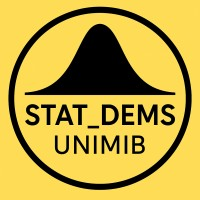

::: {.home-wrap}
{.home-logo fig-alt="STAT_DEMS UNIMIB"}

Statistica al DEMS · Università degli Studi di Milano-Bicocca

[PhD alumni](phd/index.qmd){.home-link} [Current PhD students](phd/students.qmd){.home-link}

::: {.home-small}
Siti ufficiali: [Statistica, Machine Learning ed Economia](https://www.unimib.it/triennale/statistica-machine-learning-economia) · [Scienze Statistiche ed Economiche](https://www.unimib.it/magistrale/scienze-statistiche-economiche) · [PhD ECOSTATDATA](https://www.dems.unimib.it/en/programmes/post-lauream/phd-economics-statistics-and-data-science)  
[LinkedIn](https://www.linkedin.com/company/statistica-dems-universit%C3%A0-milano-bicocca/)
:::
:::
